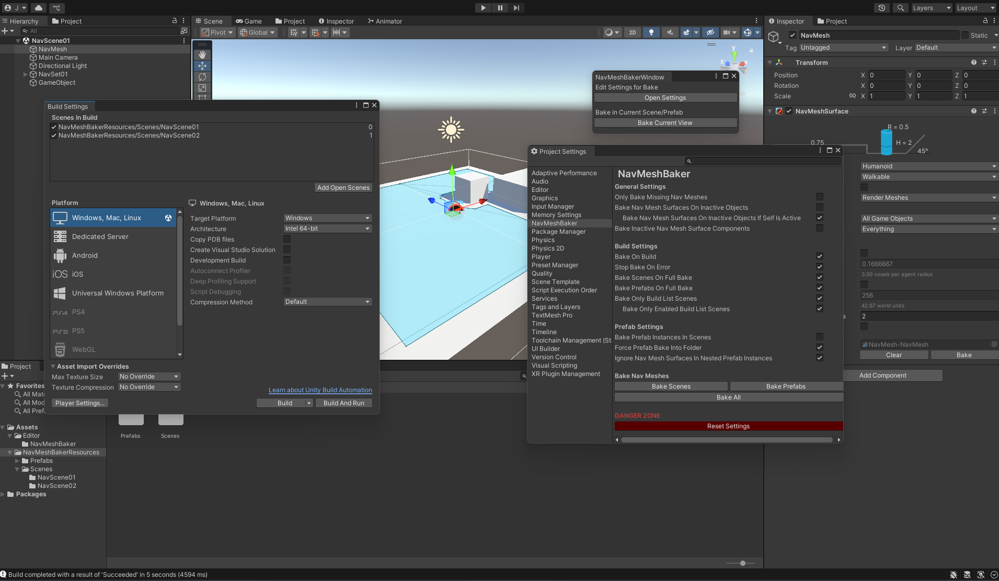

# EditorTools
Standalone Unity editor tools free for commercial use. More tools will be added when they are developed!

Credit is appreciated, but not required. If you use any of these tools in a project and would like to be listed here, just let me know and I'll link to it in this readme!

### List of Current Tools
- [NavMeshBaker](#NavMeshBaker)

## NavMeshBaker
NavMeshBaker is a helper tool to improve ease of use for baking Unity's NavMeshSurfaces.

### Features:
- Bake all NavMeshSurfaces in Scenes
- Bake all NavMeshSurfaces in Prefabs
- Bake NavMeshSurfaces on build
- Bake current open Scene/Prefab

The NavMeshBaker Window can be accessed from "Tools->NavMeshBakerWindow" in the Menu bar

The NavMeshBaker settings can be found in "Edit->Project Settings"

By default, NavMeshBaker will bake NavMeshSurfaces when the project is built. This can be disabled in the settings.

**Dissatisfied with my windows?** The NavMeshBaker class is *completely* public and static, so you can call those functions from your own scripts!

### Install:
Download the "Assets/Editor/NavMeshBaker" folder, and place it in "Assets/Editor" in your own project.

NOTE: The NavMeshBaker scripts MUST be part of an "Editor" folder, or they will break your build!
